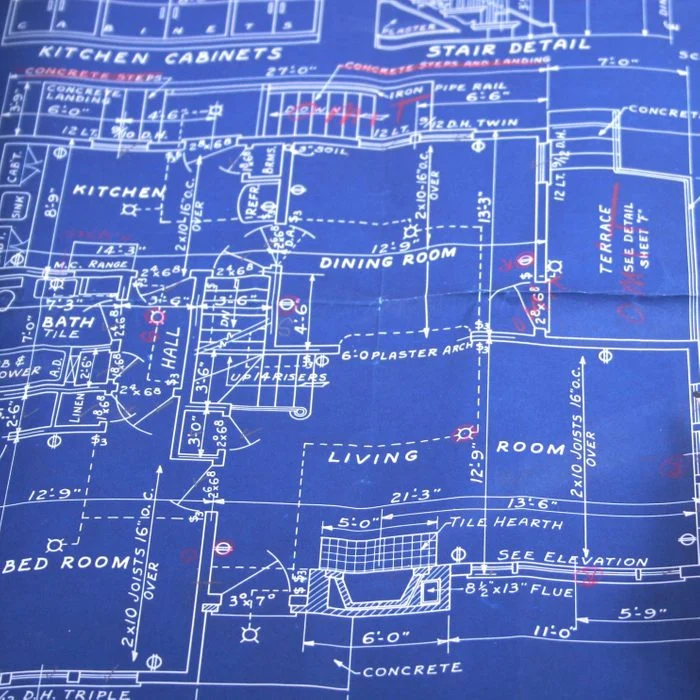

# Maybe they can!
Wouldn’t coding be simple if, for every problem that you had, someone could tell you how to do it? Well, using design patterns your wish shall (sometimes) be granted! In theory, if you have a relatively common problem when designing software design patterns are the blueprint to give you the solution to your problem with little effort having to be done on your part. I didn’t exactly know the definition of design patterns before researching this and never really thought about it before, but more likely than not if you have ever created code you have used design patterns even if you never heard the definition before. Another important thing about design patterns is that they are not written in a way that describes how they work in a specific case but is generalized in that it tells you how classes and objects interact to make the design pattern work in many different situations. 
# So what even is a design pattern?
Design Patterns typically have 4 things, a name, a problem descriptor, a solution description, and consequences. The name is usually one that tells you a bit about when the design pattern applies. The problem descriptor also tells you when the problem applies, but since it doesn’t have to be as short as the name can go into more detail about applications of the pattern. The solution description tells you about the classes, objects, and other things involved in the design pattern and also about how they are related to each other. Then the consequences tell you about what could go wrong when using the pattern against what the good parts of the pattern are.
# Do I really use them?
Design Patterns are quite common within software development and one example that I am sure many people have used before is a factory. In short, when using a factory to create an object it creates all the objects/classes that it depends on for you without you ever having to know that it even happened. It also has the advantage of being able to return multiple objects if there is a need for that. The downside to a factory though, is that if all the dependencies and advantages of it are unnecessary, it is more complicated than just a normal constructor with no real upside. Another thing to note is that design patterns fall into 3 categories: Creational, Structural, and Behavioral. Creational patterns generally create instances of classes or sometimes have something to do with objects some examples being the Factory, Object Pool, and Singleton design patterns. Structural patterns are about the composition of classes and objects, they tell you how to use objects together to get a certain function out of them some examples being the Adapter, Bridge, and Proxy design patterns. The behavior patterns deal with how the objects will communicate with each other some examples being the Iterator, State, and Null Object design patterns.
