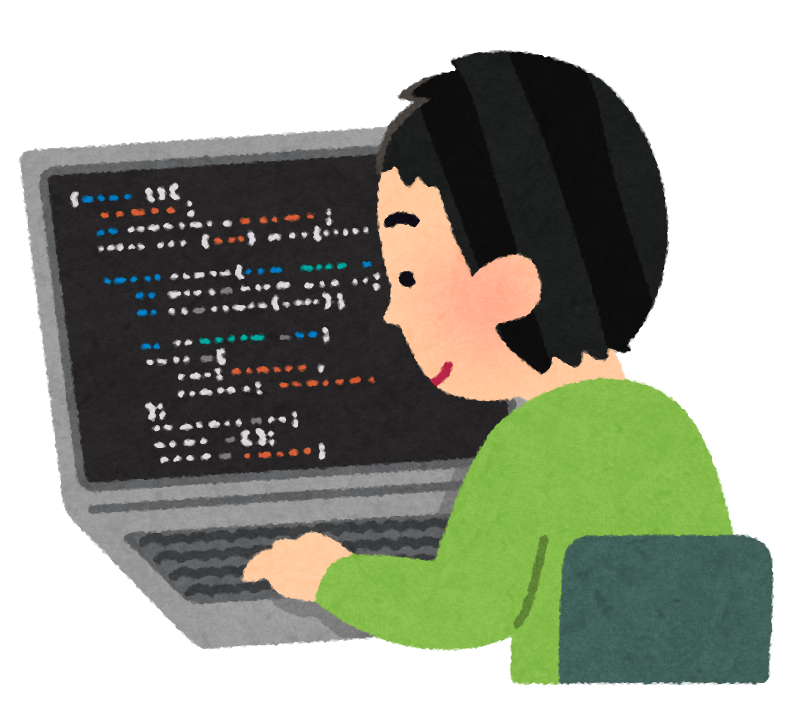

#### What is Computer Science to me?

In the past I always considered computer science to be my interest and the major I wanted to pursue when I went to college. However, I never considered the skills and practice required to succeed in the field. So coming into college I had almost no experience with any coding language or computer science concepts and even now I feel as though I have only seen the surface of the many subjects and focuses of computer science. But growing up I was exposed to many types of computer software like games and websites such as YouTube. So even if I have minimal knowledge at this point in my life I feel that my interests in computer science lie somewhere within software engineering and possibly game development. 

#### Where am I at?

In college, I have developed intermediate levels of skill in programming languages such as Java and C. But as of now the classes I am taking feel much more generalized and I am hoping to develop more specific skills once I get the credits for the prerequisite classes. Software Engineering is one such class that I think will help me learn skills that I want as it appears to be a class that has a focus on web development and I consider that a very useful skill. I also wish to take a class on video game design but haven’t been able to get to that yet due to certain time constraints.

#### What do I want to do next?

But beyond just learning these concepts in class I also want to have many opportunities to be able to put these concepts and skills to the test by doing a lot of practice. One way I was thinking about this was possibly getting an internship as it would help me practice while also being able to get help from peers and mentors who have more experience than me. Another way that I could get more experience is to join and become active in clubs such as the Game Development Club or other clubs offered on campus. This would help me develop skills in my areas of interest while also being able to practice them, work with others, and build connections.
