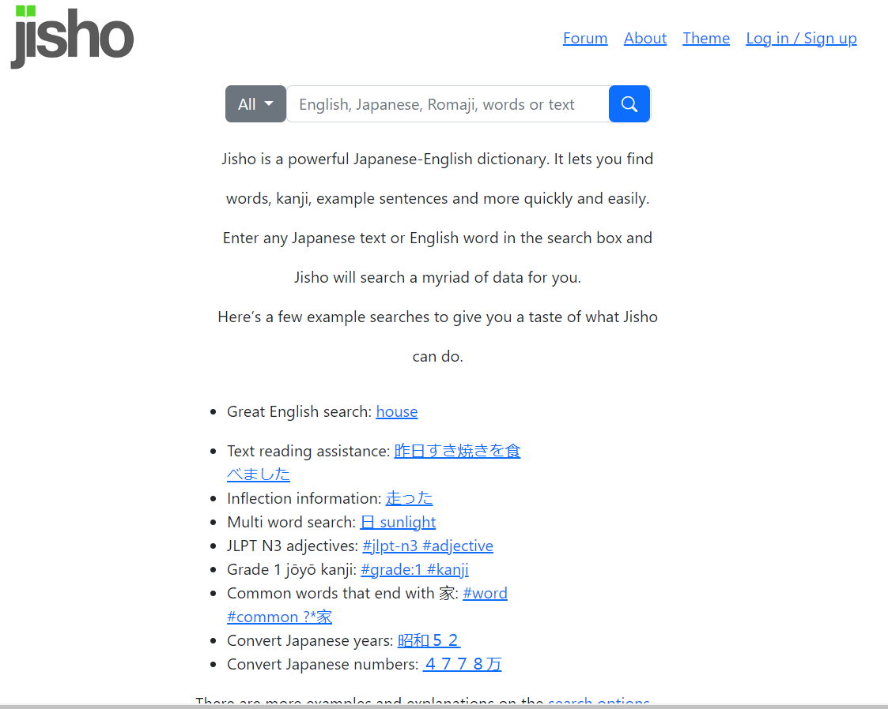
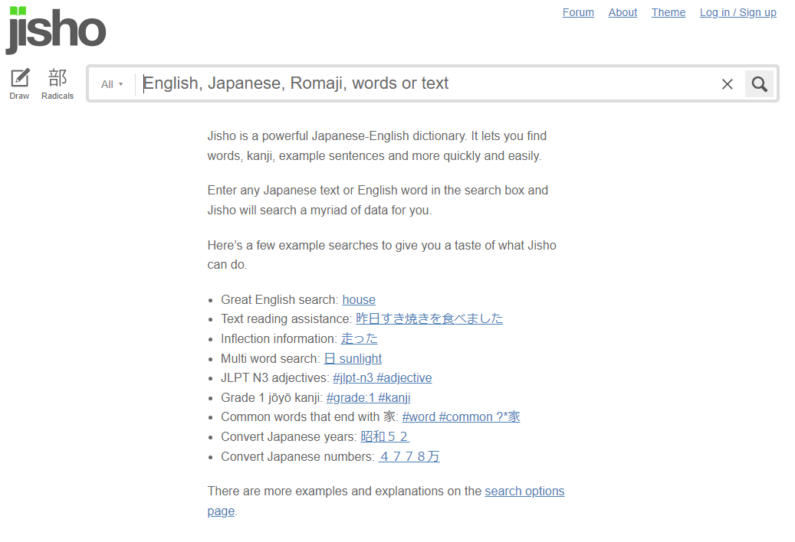

#### Bootstrap 5 is my worst enemy
Bootstrap 5 is most likely one of the most frustrating things that I have had to learn throughout my life. I can look at all the documentation that I want or look at as many examples as I think I need but somehow when I want to implement it in a project of my own it doesn’t go the way that I think it would. For example, there have been a handful of times when I am trying to center the items of a navbar so I think “Oh I can just justify-content-center” and then I put it in the class section, and nothing changes, and the navbar is just stuck hugging the left side of my screen. This is very odd to me because I will have the same div and instead of center I will justify the content to the beginning or end and it will work as expected. I’m not entirely sure why this happens I can’t find anything in the documentation that would explain the issue I am having with this. Later on, I learned of “mx-auto” which seems to work most of the time as instead of just having the content in the center it sets the margins so that the content is centered but it bugs me that justify-content-center doesn’t work for me.
#### What is going on?
I’m sure that there are many useful aspects of Bootstrap 5 and the reason why I don’t like it so much is due to my inexperience as opposed to actual flaws in itself but I feel like it shouldn’t be this hard to understand. For many assignments, I have been made to replicate the design of some websites, multiple random ones, and one that I chose myself. It would be an understatement to say that I barely understood what was going on in these assignments, it felt more like I had no idea what was going on and instead was just copying the things that I saw from the solutions from previous assignments into the future ones and prayed that they would somehow look like the website I was trying to replicate. I also found it very confusing how perfect the replications needed to be, like did we need the dropdown menus to work and the buttons to be clickable? 
#### How do I feel about UI Design?
So what do I think of UI Design? If you were to ask me this question just a week before this I think I would have said that I was pretty indifferent to it and was looking forward to learning more about it and improving my skills. But now if you ask me I would say that I am more toward the opinion that I don’t like it all that much and that I hope that I can learn a more efficient way to do it or somehow learn Bootstrap 5 in a way where I can become more confident in my skills with it.
#### Recreation of Jisho
Jisho is a Japanese translation website that I often use for translation of Kanji that I don’t know. I frequently use it and chose it as the website that I wanted to recreate. In all honesty, I chose it because it seemed quite simple. After all, it had a very limited amount of things that I had to put on it as it is a pretty bare home page. But when I had to do it I realized that it was probably my worst nightmare with all the text floating off the side of the screen. At this point, I still didn’t understand the Bootstrap grid system so I had no idea how to use columns to make the navbar items float off the ends without making individual margins for each one. Pictured below is my recreation of the website on the right with the actual website on the left. I think overall it was a very interesting assignment and that I could’ve done much better if I had given myself more time.

 
