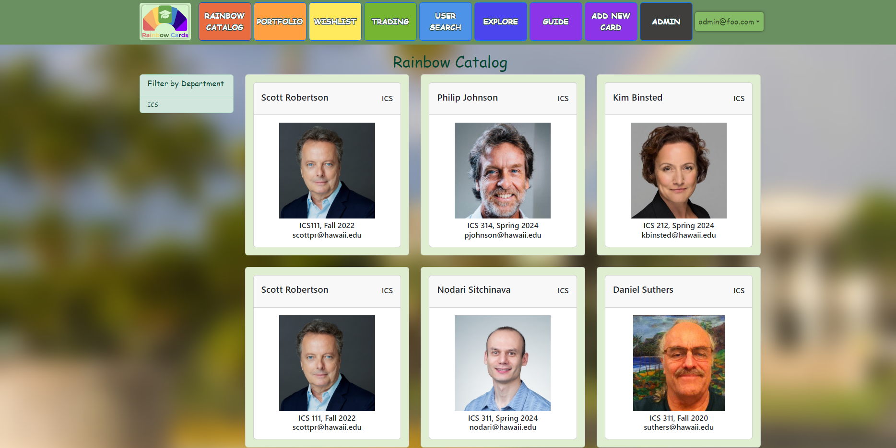

Rainbow Cards is a website that I worked on with a group of classmates for a Software Engineering class. It is designed to have cards for professors of UH Manoa so that students can learn fun facts about their professors.
Students can obtain cards from their professors when taking their course, or they can obtain other cards as well by trading with other students. 

### What did I do?
While all group members did work on various parts on the project I feel like I had a lot of involvement on the database part of the project. I created the initial database to store the information for each professor card and other group members continued to modify it as necessary as the project proceeded.
I also worked on the catalog page and wishlist pages which work similarly to eachother in that they list either all the cards that exist, or cards that you have added to your wishlist by pressing the wishlist button on the catalog page.
I also did a good amount of work on the publications page which depending on which one you use changes what data each page is accessing from the database, example:
```
// Public-level publication.
Meteor.publish('cards.public', function () {
  return ProfCards.collection.find({});
});

// Professor-level publication.

Meteor.publish(ProfCards.professorPublicationName, function () {
  if (this.userId && Roles.userIsInRole(this.userId, 'professor')) {
    const myEmail = Meteor.users.findOne(this.userId).username;
    return ProfCards.collection.find({ email: myEmail });
  }
  return this.ready();
});
```
These first publication subscribes to all cards in the database and the second one subscribes to all associated with the email that the professor is using, this is important in determining which cards professors can edit.
More info about the Rainbow Cards project is available at the project home page : [Rainbow Cards](https://rainbow-cards.github.io)
