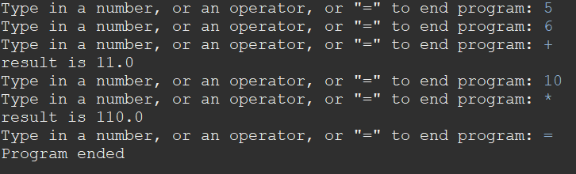

This is a program that I made in my ICS 211 class that can calculate addition subtraction multiplication and division using stacks. 

The program essentially does math in postfix where it can take 2 numbers and then perform the math operator on them and then pushes the number back onto the stack.

Example of the output when performing a couple operations:

