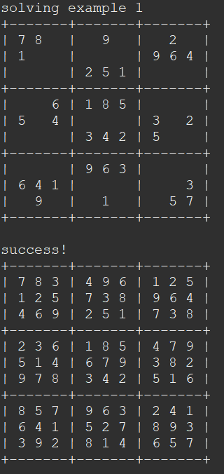

This is a sudoku solver that I made for my ICS 211 class. Sudoku is a game where you have a 9 x 9 grid also split up into a larger 3 x 3 grid pictured below:

A sudoku puzzle will have some cells already filled with numbers 1-9 and the goal of the game is to fill the rest of the cells, but you cannot have the same number within the same row, column, or inside the same 3 x 3 grid. 

So to simplify Sudoku for yourself you can input a sudoku puzzle as a 2D array into this program and as long as it is solvable it will give you the solution. It works using recursion as it will call a function to fill the squares and then check if it is correct using another function and if not it will call back the function to fill the squares but in a different way to 
find the correct solution. This assignment was very interesting and helped me learn about recursion.

This assignment was very difficult for me as at first I didn't have a great understanding of recursion and I felt that the process for this assignment was very complicated. But by the end of it, I felt like I had the hang of recursion as it is used very heavily here. I had functions called fillSudoku and checkSudoku that would work together to see if I had a solution for the sudoku. fillSudoku would go through each row and column cell and try to put a number and call checkSudoku, and if checkSudoku found a conflict with that number it would send it back to try again and this process would repeat until eventually both checkSudoku and fillSudoku return true or eventually find that there is no solution for the sudoku.

Example of it solving a sudoku puzzle:

