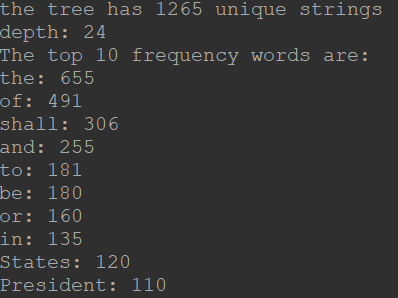

This is a program that I also made in my ICS 211 class that can take a text file as input and turn it into a binary tree and search it. 

The program will take the strings from the text file and put them into the tree and then I also created a separate program that can read over the binary search tree and find various data such as
the number of unique strings, the depth of the tree, and the top 10 most frequently occurring words in the text file.

This program was very interesting to me because I wasn't sure how to turn the text into a binary tree and then reading the text from a user file was also something quite new. Overall I think it was a very interesting experience and helped me understand binary trees more.

Example of the output when using the constitution of the United States:

